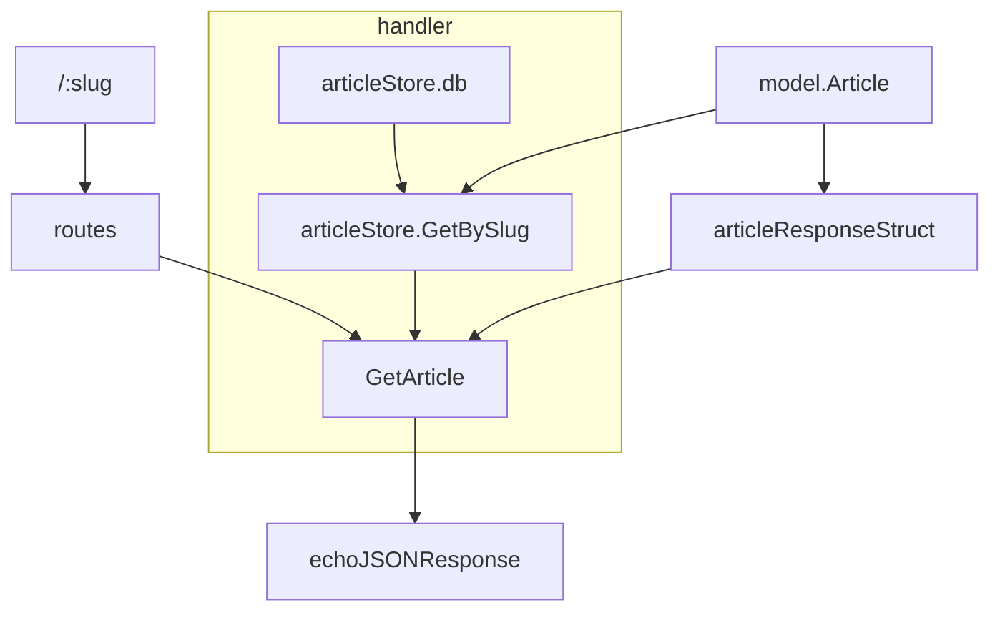

# Go and Gorm example app

In this app I build a simple JSON website using [Gorm](https://gorm.io). I was interested in how to structure a Go web application, and to learn this I leaned heavily on [Golang Echo Realworld Example](https://github.com/xesina/golang-echo-realworld-example-app).

One thing I appreciate is how the database connection is initialized in `main.go` and then passed into each store.

```go
func NewArticleStore(db *gorm.DB) *ArticleStore {
	return &ArticleStore{
		db: db,
	}
}
```

This means that the db connection is accessible by all the store's methods. I worked on an app that didn't do this and it required all sorts of passing around the db connection.

Then each store is available from the `handler`:

```go
func NewHandler(as article.Store) *Handler {
	return &Handler{
		articleStore: as,
		// other stores registered here
	}
}
```

Since `GetArticle` is a method on `Handler`, you then have access to all the other stores, which is super useful to aggregate data from various stores onto one page.

The separation of concerns is super helpful, but I've also found that means lots of individual files, which can be difficult to keep in one's mental model of the application.

